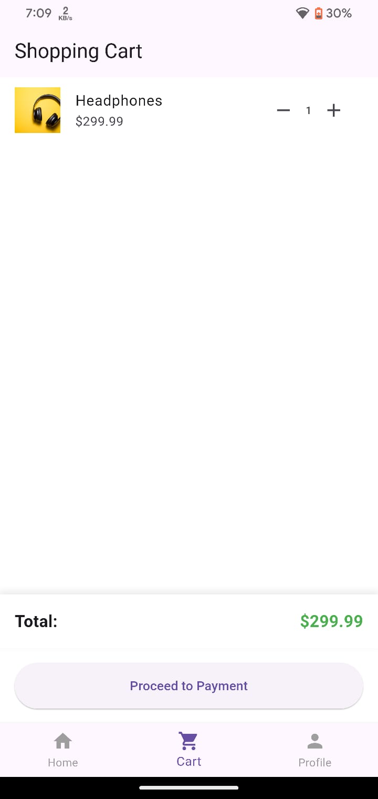
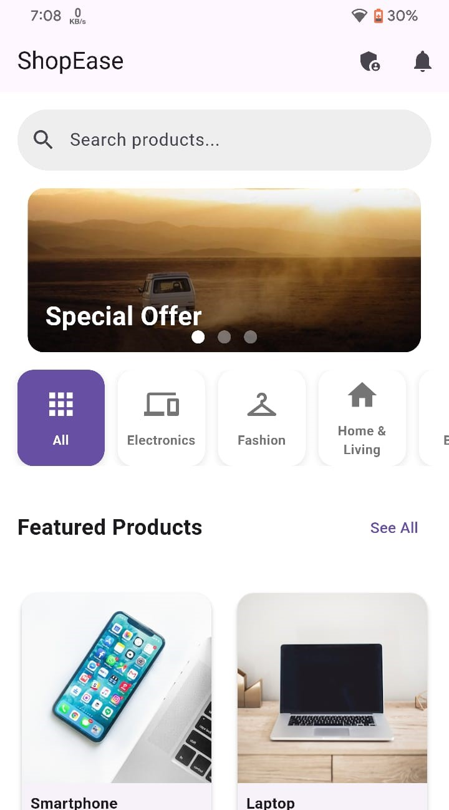
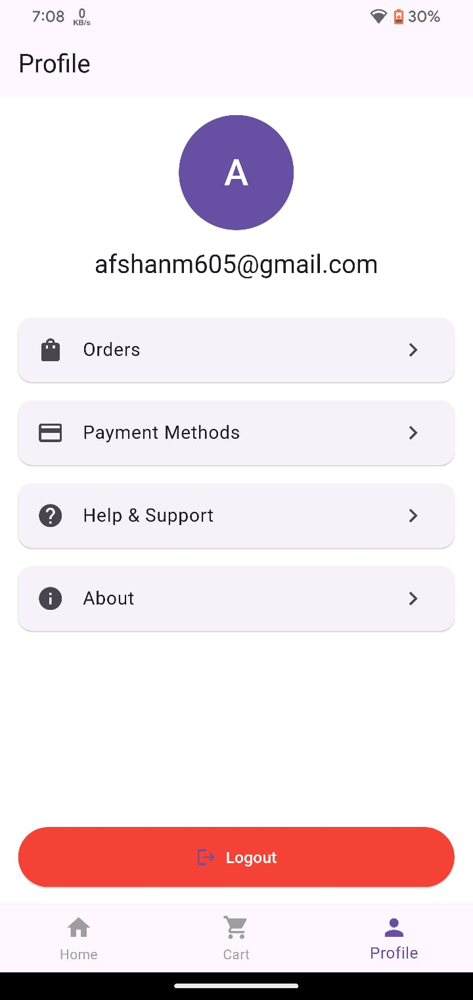
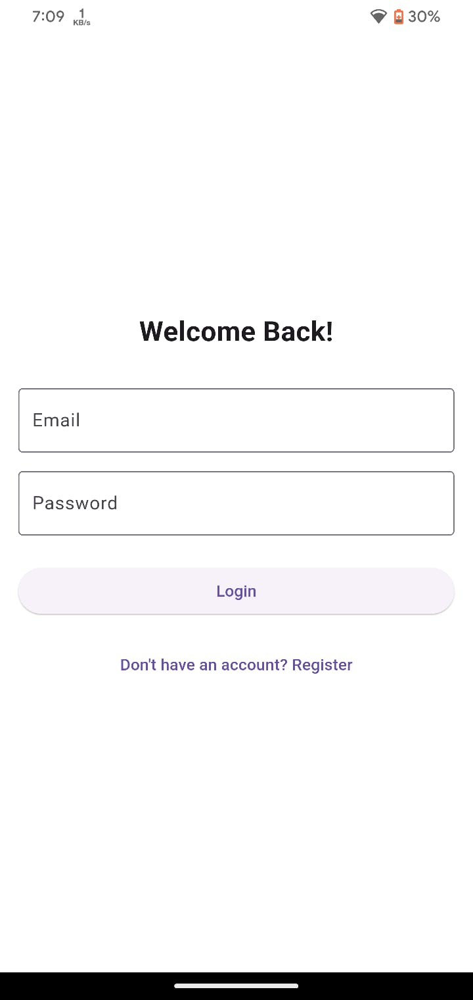
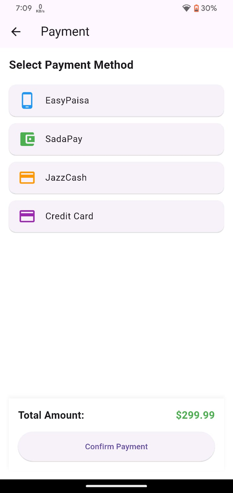
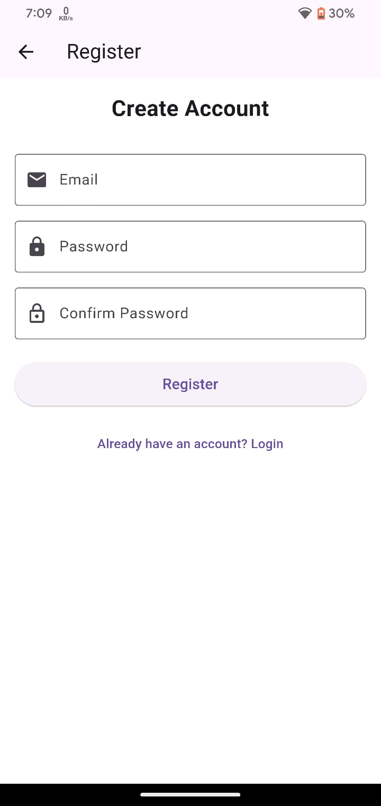

# ShopEase

ShopEase is a modern e-commerce mobile application built with Flutter. It provides a seamless shopping experience with features like product browsing, cart management, user authentication, and order tracking.

## Features

- **User Authentication**
  - Email and password registration/login
  - Secure password handling
  - Profile management

- **Product Management**
  - Browse products by categories
  - Search functionality
  - Product details with images and descriptions
  - Rating system
  - Price display in local currency (Rs.)

- **Shopping Experience**
  - Interactive product cards
  - Add to cart functionality
  - Cart management
  - Order history
  - Multiple payment methods support

- **UI Features**
  - Modern and clean interface
  - Carousel banner display
  - Category filtering
  - Responsive design
  - Loading indicators
  - Error handling

## Technologies Used

- **Frontend**
  - Flutter SDK
  - Provider for state management
  - Flutter Carousel Widget
  - Cached Network Image

- **Backend**
  - Firebase Authentication
  - Cloud Firestore
  - Supabase

## Getting Started

### Prerequisites

- Flutter SDK (>=3.2.6)
- Dart SDK
- Android Studio / VS Code
- Firebase account
- Supabase account

### Installation

1. Clone the repository:
```bash
git clone [repository-url]
```

2. Install dependencies:
```bash
flutter pub get
```

3. Configure Firebase:
   - Add your `google-services.json` to `android/app`
   - Update Firebase configuration in `lib/main.dart`

4. Configure Supabase:
   - Update Supabase URL and anonymous key in `lib/main.dart`

5. Run the application:
```bash
flutter run
```

## Project Structure

```
lib/
├── models/         # Data models
├── screens/        # UI screens
├── services/       # Business logic
└── main.dart       # App entry point
```
## 📱 App Screenshots

### 🛒 Cart Screen


### 🏠 Home Screen


### ℹ️ Info Screen


### 🔐 Login Screen


### 💳 Payment Screen


### 📝 Register Screen



